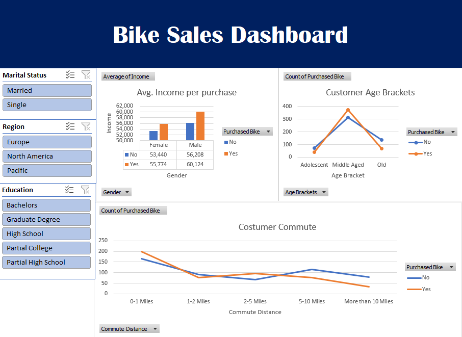

🚴 Bike Sales Customer Analysis Dashboard (Excel)

🔍 Overview

This project analyzes customer demographic and behavioral data to identify key drivers behind bike purchases. The analysis is designed to support business decisions related to targeted marketing, customer segmentation, and sales optimization.

🖼 Dashboard Preview

 

🎯 Business Problem

A retail company wants to understand:

* Which customer segments are most likely to purchase bikes
* What factors influence purchasing decisions
* How to improve marketing effectiveness and sales performance

📂 Dataset

The dataset contains customer-level information, including:

* Demographics: Age, Gender, Marital Status, Education
* Financials: Income
* Lifestyle: Commute Distance, Number of Cars, Home Ownership
* Geography: Region
* Target Variable: Purchased Bike (Yes/No)

🛠 Tools & Techniques

* Microsoft Excel
* Data Cleaning & Preprocessing
* Pivot Tables & Pivot Charts
* Slicers for interactivity
* KPI-based dashboard design

⚙️ Data Preparation

* Cleaned raw dataset by removing duplicates and handling missing values
* Standardized categorical variables for consistency
* Created derived features such as age brackets for better segmentation
* Structured data for efficient analysis and visualization

📊 Dashboard Overview

The interactive dashboard enables users to explore bike purchase behavior across multiple dimensions:

* Income vs Purchase Rate
* Age Group Segmentation
* Gender & Marital Status Comparison
* Commute Distance Impact
* Regional Sales Distribution

📈 Key Business Insights

* **Income is a strong predictor**: Higher-income customers show significantly higher purchase rates, indicating premium targeting opportunities
* **Age segmentation matters**: Middle-aged customers represent the highest conversion group
* **Commute distance influences demand**: Customers with shorter commutes are more likely to purchase bikes, suggesting utility-driven buying behavior
* **Regional differences exist**: Certain regions outperform others, highlighting opportunities for localized marketing strategies

💼 Business Recommendations

* Target high-income customer segments with premium marketing campaigns
* Focus advertising on middle-aged demographics for higher conversion rates
* Promote bikes as a commuting solution in regions with shorter travel distances
* Allocate marketing budget based on region-specific performance

▶️ How to Use

1. Download the Excel file
2. Open in Microsoft Excel
3. Use slicers to filter and explore different customer segments

🚀 Outcome

Developed an interactive dashboard that transforms raw customer data into actionable insights, enabling data-driven decision-making in marketing and sales strategy.
